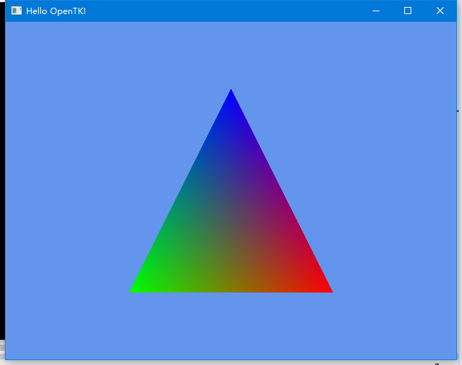

## 目标
1. 了解渲染基本原理 
    - 理解什么是光栅化，美术资源输入如何变成画面
2. 了解游戏引擎的基本逻辑
    - 了解引擎在图形渲染之上包装了哪些功能
3. 用原始图形API实现自己的游戏demo 
    - 自己使用OpenglAPI绘制自己的美术资源

## 第一课：用顶点绘制三角形（5小时)
1. 用opentk打开opengl窗口（1小时）
    - 直接在NuGet中安装OpenTK即可
    - 用OpenTK框架打开默认窗口
    - 理解窗口、缓冲区概念
    - Tips
        > 说明：Tips为遇到问题时可提供的参考，请自己先思考、实践之后再看，以下雷同
        - http://neokabuto.blogspot.com/2013/02/opentk-tutorial-1-opening-windows-and.html
        - https://opentk.net/learn/chapter1/1-creating-a-window.html

2. 用顶点绘制最简单的三角形（4小时）
    - 相关接口
        > 说明：因为实现最后结果（也就是目标效果图）的方式可以有很多种，所以以下这些接口并不是充分必要条件； 为提高学习效用，请先自行查找相关API，以下雷同
        - GL.Clear
        - Matrix4.CreatePerspectiveFieldOfView
        - Matrix4.LookAt
        - GL.Begin
        - GL.Vertex3、GL.Color
    - Tips
        - 理解“OpenGL是一个状态机”
        - 理解模型空间坐标系、相机空间坐标系、视口空间坐标系、屏幕空间坐标系的区别
            - 回忆线性代数中关于矩阵的用法
        - https://learnopengl-cn.github.io/01%20Getting%20started/07%20Transformations/
        - https://learnopengl-cn.github.io/01%20Getting%20started/08%20Coordinate%20Systems/

3. 目标效果图 
    - 

## 第二课:了解着色器的基本使用
> 说明：第二课和第三课关系密切，请可以适当结合一起学习
1. 了解如何载入并使用shader（1小时）
    - 相关接口
        - GL.CreateProgram
        - GL.CompileShader
        - GL.AttachShader
2. 理解不同着色阶段的数据传递（3小时）
    - 相关接口
        - GL.VertexAttribPointer
    - Tips
        - 绑定点: 应用程序阶段（cpu）的数据Shader（gpu）如何读取？
            - 理解VAO中的数据存储及偏移
        - 传递：Application -> Vertex -> Fragment
            - 理解顶点着色器的输入、输出是啥
            - 理解像素着色器的输入、输出是啥
        - http://neokabuto.blogspot.com/2013/03/opentk-tutorial-2-drawing-triangle.html
        - https://opentk.net/learn/chapter1/2-hello-triangle.html
        - https://learnopengl-cn.github.io/01%20Getting%20started/04%20Hello%20Triangle/

## 第三课：利用缓冲区对象替换GL.Vertex3绘制之前的三角形
1. 理解关于顶点绘制的各种缓冲区对象（2小时）
    - Tips
        - VAO、VBO、EBO
        - 理解顶点和索引的区别
        - https://opentk.net/learn/chapter1/2-hello-triangle.html
        - https://learnopengl-cn.github.io/01%20Getting%20started/04%20Hello%20Triangle/
2. 利用缓冲区对象替换GL.Vertex3绘制之前的三角形（6小时）
    - 相关接口
        - GL.GenBuffers
        - GL.BindBuffer
        - GL.BufferData
        - GL.DrawArray 或者 GL.DrawElement

3. 目标 
    - 

## 第四课：封装
1. 重构之前的代码（6小时）
    - 封装Shader类
    - 抽离Geometry类
    - 实现Camera类
        - 实现旋转、注视并更新矩阵
2. 新建自己的场景，并创建相机围绕场景旋转（2小时）
    - Tips
        - http://neokabuto.blogspot.com/2014/01/opentk-tutorial-5-basic-camera.html

## 第五课：支持Obj格式
1. 弄明白Obj格式定义（1小时）
1. 给Geometry类添加LoadObjFromFile()接口（1小时）
2. 添加Scene类（1小时）
3. 将Res/Geometry/tetrahedron.obj载入场景并显示（1小时）
4. 将上述四面体创建50个以不同的位置、旋转、缩放放置于场景中的不同位置，并能正确显示（3小时）

## 第六课：实现自己的StaticBatching或者Dynamic Batching
1. 如果不做任何处理，上述场景至少有50个Drawcall
2. 采用上述技术中的一种来减少Drawcall
3. （可选）用Instancing技术来减少Drawcall

## 第七课：实现物体层面的视锥体裁剪
1. 思考为什么要这么做？
2. 封装Gameobject类，并添加AABB box功能
3. 实现视锥体裁剪

## 第七课：加载纹理并贴图
1. 添加Texture类，并实现LoadTexFromFile()接口
2. 在shader中贴图

## 第八课：实现Lambert光照
1. 添加Light类
2. 在shader中实现光照

## 添加动画
1. 添加顶点动画
2. 用shader实现顶点动画
3. 添加骨骼动画